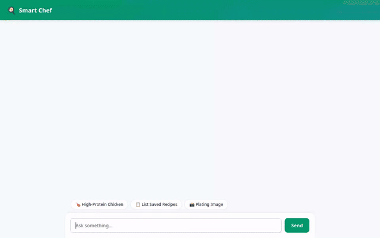

# 🍳 Smart Chef

An intelligent personal culinary and nutrition AI assistant built with **Google Agent Development Kit (ADK)**, **Vertex AI Agent Engine**, **Vertex AI Memory Bank**, **Cloud Firestore**, **Imagen 3**, **Gemini Omni**, and **A2UI**.



---

## 🌟 Capabilities & Implemented Tools

Smart Chef is powered by a set of custom tools and Google Cloud services wired directly into the agent runtime:

### 🧠 Cross-Session Personal Memory
- **Vertex AI Memory Bank (`VertexAiMemoryBankService`)**: Automatically remembers user dietary preferences, food allergies, macro targets, pantry inventory, and kitchen equipment across conversations.
- **Preload Memory Tool (`PreloadMemoryTool`)**: Inject persistent user context directly into every request.

### 🍲 Firestore Recipe Database
- **`list_recipes()`**: Query saved personal recipes stored in Google Cloud Firestore.
- **`get_recipe(title)`**: Retrieve ingredients, step-by-step instructions, and prep time for a specific dish.
- **`add_recipe(title, ingredients, instructions, prep_time)`**: Add new custom recipes to the user's Firestore collection.

### 🔍 Online Recipe Search & Meal Discovery
- **`search_online_recipes(query)`**: Real-time integration with TheMealDB API to fetch global recipes, ingredient lists, and cooking instructions.

### 🧮 Code Execution & Nutritional Mathematics
- **`calculate_recipe_scale_and_macros(servings, ingredients)`**: Uses a secure Python code execution sandbox (`AgentEngineSandboxCodeExecutor`) to dynamically compute scaled ingredient quantities and macronutrient totals (protein, carbs, fats, calories).

### 📸 Dish Plating Image Generation
- **`generate_plating_image(dish_name, description)`**: Uses Google's **Imagen 3 (`imagen-3.0-generate-002`)** model to generate high-resolution culinary plating photos, saves them to ADK Artifacts, and stores them in Google Cloud Storage.

### 🎬 Culinary Video Clip Generation
- **`generate_recipe_video(dish_name, description)`**: Uses Google's **Omni model (`gemini-omni-flash-preview`)** in the `global` region to generate short cooking and plating demonstration clips, saves them to ADK Artifacts, and uploads MP4 files to Google Cloud Storage.

### 🎛️ A2UI & Custom HTML5 Media UI
- **A2UI Protocol (v0.8)**: Generates structured Card, Column, Row, Text, and Image UI elements.
- **HTML5 Video Player**: Frontend proxy auto-detects generated `.mp4` video URLs and embeds an inline video player with interactive controls inside the chat dialogue.

---

## 🏗️ Architecture & Google Cloud Services

Smart Chef integrates the following Google Cloud services:

- **Vertex AI Agent Engine / Agent Runtime**: Serverless runtime hosting the ADK agent framework.
- **Vertex AI Memory Bank**: Managed memory service storing long-term user preferences and facts.
- **Google Cloud Firestore**: Document database powering user recipe storage.
- **Google Cloud Storage**: Public media storage bucket for generated dish images and video clips.
- **Vertex AI Imagen 3**: Text-to-image generation for dish plating visualizations.
- **Vertex AI Gemini Omni**: Multimodal interaction model generating culinary video clips.
- **Cloud Run & FastAPI**: Microservice proxy serving the A2A protocol and custom chat interface.

---

## 🛠️ Project Structure

```
smart-chef/
├── app/
│   ├── agent.py               # Root ADK Agent, system prompt, tools, callbacks
│   ├── fast_api_app.py        # FastAPI Backend server
│   └── app_utils/             # Memory bank, Firestore, and tool helpers
├── frontend/
│   ├── main.py                # FastAPI proxy forwarding A2A protocol requests
│   └── static/
│       └── index.html         # Custom chat interface & A2UI + Video renderer
├── agents-cli-manifest.yaml   # Agent Engine deployment configuration
├── project_brief.md           # Project architecture overview
└── demo.gif                   # Looping video recording of the agent in action
```

---

## 🚀 Setup & Local Execution

### Prerequisites

Ensure you have installed:
- Python 3.10+
- Node.js & npm
- Google Cloud SDK (`gcloud`)
- `agents-cli` (`uv tool install google-agents-cli`)

### Environment Setup

1. **Clone the repository**:
   ```bash
   git clone <repository-url>
   cd smart-chef
   ```

2. **Set Google Cloud Environment Variables**:
   ```bash
   export GOOGLE_CLOUD_PROJECT="<your-gcp-project-id>"
   export FIRESTORE_PROJECT="<your-gcp-project-id>"
   export AGENT_ENGINE_RESOURCE_NAME="projects/<project-number>/locations/us-east1/reasoningEngines/<engine-id>"
   export AGENT_DIRECTORY="app"
   ```

3. **Install Dependencies**:
   ```bash
   agents-cli install
   npm install
   ```

### Running Locally

1. **Launch the Local Development Playground**:
   ```bash
   agents-cli playground
   ```

2. **Launch the Custom Frontend Proxy Server**:
   ```bash
   cd frontend
   python main.py
   ```
   *The custom chat UI will start on port 8080.*

---

## 🧪 Testing & Deployment

- **Run Quality Checks**:
  ```bash
  agents-cli lint
  ```

- **Deploy Agent to Agent Runtime**:
  ```bash
  agents-cli deploy --no-confirm-project
  ```
